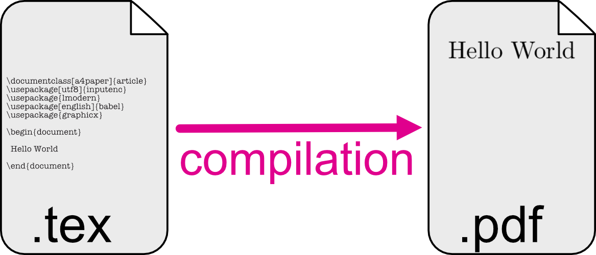

## What it is

LaTeX is a typesetting system, you can use it for writing articles, books, thesis or any kind of written document.

It integrates a lot of useful tools for managing figures, tables, table of contents, equations, etc.

LaTeX is ideal because it generates beautiful documents easily.

A LaTeX document looks like... [this example](../latex/pdf/latexprinciples.pdf). 

## How it works

LaTeX is different from a what-you-see-is-what-you-get software like Microsoft Word, because you can't see how the document will look like immediately, before it has been processed by the Latex software. This process is called **compilation**.

The compilation transforms your text source into a PDF document, distributing text across lines and pages, composing paragraphs, building tables, generating formulas, inserting images, keeping of track of numbering and references, etc.

As the author, you edit a source file which is just a simple text file, containing your text along with formatting commands. Those commands will be read during the compilation and will lead to the final document.

## Who does what

As the author, you produce content meaning you focus on the text---and only the text!---while issuing formatting instructions to express your intention by defining the role and function of each part of text.

The compilation is in charge of the layout. It will translate your intentions into graphical design using pre-established style sheets and adhering to typographic conventions.

## Why it is nice
By separating the content (the text and the formatting) from the form (how it will look like) LaTeX has a lot of nice features that are hard to beat :

* The document will always looks nice, because the pre-established style are designed to be functional and readable
* It can manage huge documents, because the pictures and other huge file are not loaded while you type
* You can easily manage citations, references, tables of contents, etc.
* You can easily change the style of your document, for example if you decide at some point to change the font size of the title, it will take you 2 seconds to do it
* You can write readable equations


